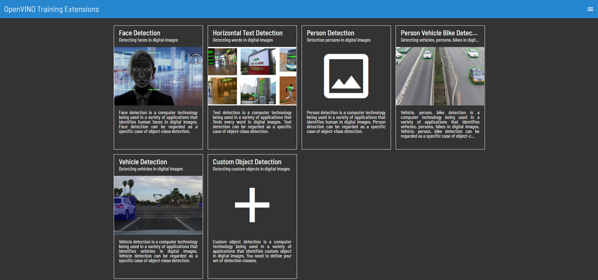

# インテル® OpenVINO™ ツールキット Training Extensionを使ってみる

この内容は[公式レポジトリ](https://github.com/openvinotoolkit/training_extensions/tree/develop/web)を和訳し、かつ、ちょっとしたTipsを追記したものです。

## Training Extensionとは
インテル® OpenVINO™ ツールキットが提供している機能の一つであり、主に物体検出のディープラーニングモデルをNo Code（つまりGUI操作のみ）で構築できる機能です。また、最近のアップデートにより、同じくOpenVINOの機能の一つであるGUIアノテーションツールのCVATと統合され、アノテーションからトレーニングまでをGUI操作のみで実施できるようになっております。

Training ExtensionはDockerイメージとして配布されている複数のサービスおよびコンポーネントをDocker Composeにて構成して動作するWebアプリケーションです。従って、DockerおよびDocker Composeが動作する環境であればいずれの環境でも動作可能と思われますが、ここではUbuntu 18.04をベースにインストール方法から操作方法までを記載します。

## インストール

### 前提条件
- Ubuntu 18.04

### Dockerをインストール

```sh
sudo apt update
sudo apt install apt-transport-https ca-certificates curl software-properties-common
curl -fsSL https://download.docker.com/linux/ubuntu/gpg | sudo apt-key add -
sudo add-apt-repository "deb [arch=amd64] https://download.docker.com/linux/ubuntu bionic stable"
sudo apt update
sudo apt install docker-ce
```

#### インストールを検証

```sh
sudo systemctl status docker
● docker.service - Docker Application Container Engine
   Loaded: loaded (/lib/systemd/system/docker.service; enabled; vendor preset: enabled)
  Drop-In: /etc/systemd/system/docker.service.d
           └─https-proxy.conf, intel.conf, override.conf
   Active: active (running) since Tue 2020-07-21 13:52:39 MSK; 35min ago
     Docs: https://docs.docker.com
 Main PID: 2003 (dockerd)
    Tasks: 104
   CGroup: /system.slice/docker.service
           ├─2003 /usr/bin/dockerd --host=fd:// --add-runtime=nvidia=/usr/bin/nvidia-container-runtime-hook
           ├─3533 /usr/bin/docker-proxy -proto tcp -host-ip 0.0.0.0 -host-port 8080 -container-ip 172.21.0.4 -container-port 80
           └─4023 /usr/bin/docker-proxy -proto tcp -host-ip 0.0.0.0 -host-port 8888 -container-ip 172.20.0.6 -container-port 8888
```

#### Dockerをrootとしてsudo無しで使えるよう設定

```sh
sudo usermod -aG docker ${USER}
```

#### （任意）プロキシ設定

コンテナを起動するユーザのホームディレクトリにあるファイル `~/.docker/config.json` を作成または編集します。

```sh
{
 "proxies":
 {
   "default":
   {
     "httpProxy": "http://127.0.0.1:3001",
     "httpsProxy": "http://127.0.0.1:3001",
     "noProxy": "*.test.example.com,.example2.com"
   }
 }
}
```

※注意：こちらの操作実行後はサーバーへの再ログインが必須

### Docker Composeをインストール

```sh
sudo curl -L "https://github.com/docker/compose/releases/download/1.26.2/docker-compose-$(uname -s)-$(uname -m)" -o /usr/local/bin/docker-compose
sudo chmod +x /usr/local/bin/docker-compose
```

#### インストールを検証

```sh
docker-compose --version
```
とタイプすると以下のように表示されるはずです。
```sh
docker-compose version 1.26.2, build 1110ad01
```


### 起動

```sh
git clone --branch develop --recursive https://github.com/openvinotoolkit/openvino_training_extensions.git
cd openvino_training_extensions
git submodule update --init --recursive
IDLP_HOST=ホストのIPアドレス docker-compose -f docker-compose.cpu.yml up --build -d
```
※ホストのIPアドレスはローカル環境であればlocalhost。リモートからアクセスしたい場合はホストOSのIPアドレスを入力下さい。

#### CVATへのアクセス用のrootユーザーを作成

```sh
docker exec -it cvat bash -ic 'python3 ~/manage.py createsuperuser'
```

※ユーザー名とパスワードは任意のものを入力ください。何でも良ければ以下のものを入力ください。
- Username: django
- Email address: 省略可能
- Password: django

パスワードが緩いので「本当にこれでアカウント作りますか？」的な警告が出ますが、気にせずにyを入力ください。

### Webブラウザにて開く

`http://ホストのIPアドレス:8001`

下記ような画面が開けば成功。ツールの使い方は[こちら](how-to-use.md)を参照ください。



### 停止

```sh
docker-compose -f docker-compose.cpu.yml down
``` 

### 再開

```sh
docker-compose -f docker-compose.cpu.yml up -d
``` 
